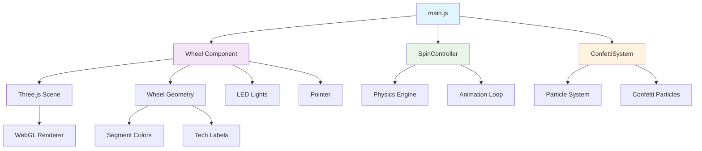

# 2D Tech Wheel

> A modern, customizable 2D spinning wheel built with Three.js and a physics-based spin controller. Features tech-themed segments with smooth animations, LED effects, and confetti celebrations.


---

## Features

- **Tech-Themed Segments**: 8 programming languages and technologies (JavaScript, Python, TypeScript, React, Node.js, Go, Rust, Swift)
- **Physics-Based Spinning**: Custom spin controller with realistic deceleration and momentum
- **LED Rim Effects**: Animated LED lights around the wheel perimeter with pulsing colors
- **Confetti System**: Particle-based confetti celebration when the wheel stops
- **Smooth Animations**: 60fps rendering with optimized Three.js performance
- **Responsive Design**: Adapts to different screen sizes and orientations
- **Customizable**: Easy to modify segments, colors, and wheel configuration
- **Modern Architecture**: Clean ES6+ modules with separation of concerns

---

## Technologies Used

- **Graphics**: [Three.js](https://threejs.org/) - 3D graphics library for WebGL
- **Physics**: Custom physics-based spin controller with realistic deceleration
- **Particle Effects**: Custom confetti system using Three.js geometries
- **Module System**: Native ES6 modules with modern import/export syntax
- **Code Quality**: ESLint with modern rules, Prettier for formatting

---

## Code Architecture



---

## Getting Started

### Prerequisites

- Node.js 18.0.0 or higher
- A modern web browser that supports WebGL and ES Modules

### Installation

1. **Clone the repository:**

   ```bash
   git clone https://github.com/your-username/2d-tech-wheel.git
   cd 2d-tech-wheel
   ```

2. **Install dependencies:**
   ```bash
   npm install
   ```

### Running the Project

1. **Start the development server:**

   ```bash
   npm run dev
   ```

   This will start a live server on `http://127.0.0.1:8080` and automatically open your browser.

2. **Alternative - Manual server:**
   ```bash
   npm start
   ```
   Then manually navigate to `http://127.0.0.1:8080` in your browser.

---

## Code Quality Checks

The project ships with automated quality tooling to keep the codebase consistent and secure:

- `npm run lint:ci` — ESLint (flat config) with modern rules from Unicorn, SonarJS, Security, Import-X, and more, failing on any warning.
- `npm run format:check` — Prettier validation across JS/JSON/HTML/CSS/Markdown/YAML files.
- `npm run audit:ci` — `npm audit --omit dev --audit-level=moderate` to surface vulnerable runtime dependencies.
- `npm run check:quality` — Convenience task that runs all of the above sequentially.

These commands execute in CI for Node 18 and Node 20 to guarantee cross-version compatibility.

---

## How to Customize

Customizing the wheel is easy! All the main configuration is located in `src/components/Wheel.js`.

### Changing Wheel Segments (Tech Labels and Colors)

1. **Open `src/components/Wheel.js`**.
2. Find the `segments` array in the constructor configuration:

   ```javascript
   segments: [
     { label: 'JavaScript', color: 0x3498db },
     { label: 'Python', color: 0x2ecc71 },
     { label: 'TypeScript', color: 0x9b59b6 },
     { label: 'React', color: 0xe74c3c },
     { label: 'Node.js', color: 0x1abc9c },
     { label: 'Go', color: 0x34495e },
     { label: 'Rust', color: 0xf39c12 },
     { label: 'Swift', color: 0x27ae60 },
   ];
   ```

3. **To change the tech labels**, edit the `label` property of each segment object.
4. **To change the colors**, edit the `color` property using hex values (e.g., `0x3498db` for blue).
5. **To add/remove segments**, simply add or remove objects from the array. The wheel will automatically adjust to the new number of segments.

### Customizing LED Effects

You can modify the LED rim effects by changing these properties in the Wheel constructor:

```javascript
ledCount: 16,           // Number of LED lights
ledRadius: 3.7,         // Distance from center
ledSize: 0.08,          // Size of each LED
ledColors: [0xff0000, 0x00ff00, 0x0000ff, 0xffff00, 0xff00ff, 0x00ffff]
```

---

## Project Structure

```
src/
├── main.js                 # Entry point and scene setup
├── components/
│   └── Wheel.js           # Main wheel component with segments and LEDs
├── controllers/
│   └── SpinController.js  # Physics-based spinning logic
└── effects/
    └── ConfettiSystem.js  # Particle system for celebrations
```

## Contributing

Contributions, issues, and feature requests are welcome! Feel free to check the [issues page](https://github.com/your-username/2d-tech-wheel/issues).

---

## License

This project is licensed under the MIT License - see the [LICENSE.md](LICENSE.md) file for details.
