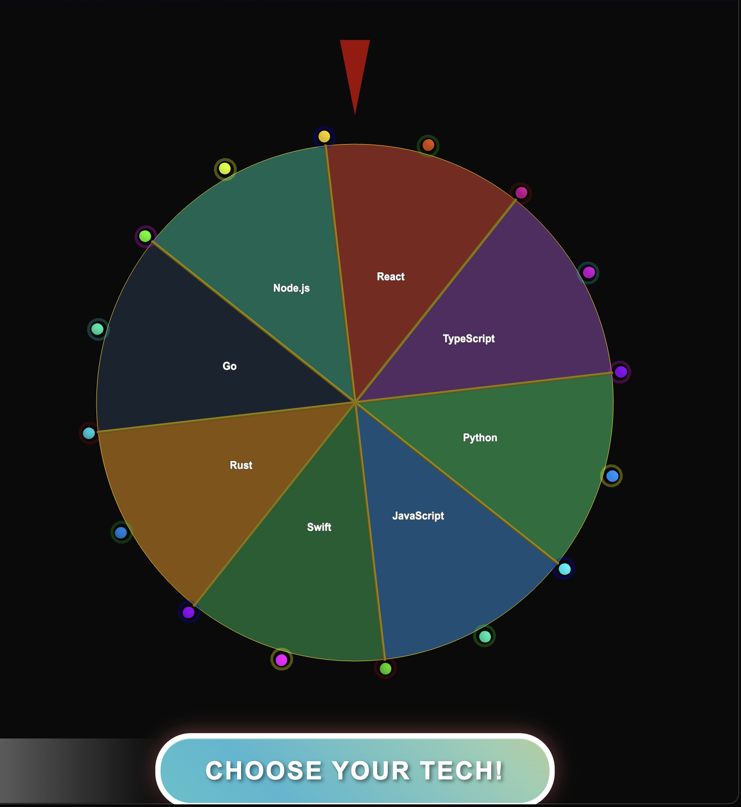

# Halloween Decision Wheel

> A spooky, customizable 2D spinning wheel built with Three.js and a physics-based spin controller. Features Halloween-themed segments with smooth animations, LED effects, and confetti celebrations.



---

## Features

### Core Wheel Features
- **Halloween-Themed Segments**: 8 spooky activities (Haunted House, Pumpkin Patch, Witch's Brew, Ghost Town, Blood Moon, Candy Corn, Black Cat, Graveyard)
- **Winner Display**: Animated result card that shows the winning segment with matching colors
- **Cooldown Timer**: Visual countdown showing when you can spin again
- **Physics-Based Spinning**: Custom spin controller with realistic deceleration and momentum
- **3D Depth & Perspective**: Extruded wheel geometry with beveled edges and dynamic shadow

### Visual Effects
- **LED Chase Effects**: Animated LED lights that rotate and brighten during wheel spin
- **Confetti System**: Particle-based confetti celebration in winning segment colors
- **Dynamic Camera**: Camera zooms in during fast spins and shakes at high velocities
- **Segment Hover Effects**: Interactive segments that scale and glow on mouse hover
- **Animated Audience**: 6 people watching the wheel from the same perspective, swaying gently

### Audio System
- **Procedural Sound Effects**: Web Audio API generates all sounds without audio files
- **Click Sound**: Button press feedback
- **Whoosh Sound**: Spin start effect
- **Tick Sounds**: Variable pitch ticking as wheel slows down
- **Fanfare**: Winner announcement chord progression

### Accessibility & Controls
- **Keyboard Support**: Space or Enter to spin the wheel
- **Mobile Touch Gestures**: Swipe down to spin with haptic feedback
- **ARIA Labels**: Full screen reader support
- **Reduced Motion**: Respects prefers-reduced-motion settings
- **Semantic HTML**: Proper roles and live regions for announcements

### Data & Performance
- **Spin History Tracking**: Tracks last 10 spins with statistics in localStorage
- **Smooth Animations**: 60fps rendering with optimized Three.js performance
- **Responsive Design**: Adapts to different screen sizes and orientations
- **Customizable**: Easy to modify segments, colors, and wheel configuration
- **Modern Architecture**: Clean ES6+ modules with separation of concerns

---

## Technologies Used

- **Graphics**: [Three.js](https://threejs.org/) - 3D graphics library for WebGL
- **Audio**: [Web Audio API](https://developer.mozilla.org/en-US/docs/Web/API/Web_Audio_API) - Procedural sound generation
- **Physics**: Custom physics-based spin controller with realistic deceleration
- **Particle Effects**: Custom confetti system using Three.js geometries
- **Storage**: localStorage for persistent spin history tracking
- **Accessibility**: ARIA attributes, keyboard navigation, screen reader support
- **Mobile**: Touch events API with haptic feedback
- **Module System**: Native ES6 modules with modern import/export syntax
- **Code Quality**: ESLint with modern rules, Prettier for formatting

---

## Code Architecture

The project follows a modular architecture with clear separation of concerns:


---

## Getting Started

### Prerequisites

- Node.js 18.0.0 or higher
- A modern web browser that supports WebGL and ES Modules

### Installation

1. **Clone the repository:**

   ```bash
   git clone https://github.com/your-username/2d-tech-wheel.git
   cd 2d-tech-wheel
   ```

2. **Install dependencies:**
   ```bash
   npm install
   ```

### Running the Project

1. **Start the development server:**

   ```bash
   npm run dev
   ```

   This will start a live server on `http://127.0.0.1:8080` and automatically open your browser.

2. **Alternative - Manual server:**
   ```bash
   npm start
   ```
   Then manually navigate to `http://127.0.0.1:8080` in your browser.

---

## Code Quality Checks

The project ships with automated quality tooling to keep the codebase consistent and secure:

- `npm run lint:ci` — ESLint (flat config) with modern rules from Unicorn, SonarJS, Security, Import-X, and more, failing on any warning.
- `npm run format:check` — Prettier validation across JS/JSON/HTML/CSS/Markdown/YAML files.
- `npm run test:ci` — Run Jest tests with coverage in CI mode.
- `npm run audit:ci` — `npm audit --omit dev --audit-level=moderate` to surface vulnerable runtime dependencies.
- `npm run check:quality` — Convenience task that runs all of the above sequentially.

### Pre-commit Hooks

The project uses Husky and lint-staged to automatically run quality checks before each commit:
- ESLint with auto-fix on staged JavaScript files
- Prettier formatting on all staged files
- Jest tests for changed test files

Install hooks after cloning: `npm install` (runs `npm run prepare` automatically)

These commands execute in CI for Node 18 and Node 20 to guarantee cross-version compatibility.

---

## Testing

The project includes comprehensive unit tests using Jest:

```bash
npm test          # Run tests with coverage
npm run test:watch # Run tests in watch mode
npm run test:ci   # Run tests in CI mode
```

Tests cover:
- Utility functions (crypto, math helpers)
- Spin controller physics logic
- Repository-level anti-pattern detection (no emojis, no empty catch blocks)

Test files are located alongside their source code in `__tests__` directories.

---

## How to Customize

Customizing the wheel is easy! All the main configuration is located in `src/config/appConfig.js`.

### Changing Wheel Segments (Labels and Colors)

1. **Open `src/config/appConfig.js`**.
2. Find the `WHEEL_SEGMENTS` array at the top of the file:

   ```javascript
   const WHEEL_SEGMENTS = [
     { label: "Haunted House", color: 0x1a0a00 },
     { label: "Pumpkin Patch", color: 0xff6600 },
     { label: "Witch's Brew", color: 0x4b0082 },
     { label: "Ghost Town", color: 0xcccccc },
     { label: "Blood Moon", color: 0x8b0000 },
     { label: "Candy Corn", color: 0xffa500 },
     { label: "Black Cat", color: 0x0a0a0a },
     { label: "Graveyard", color: 0x2f4f2f },
   ];
   ```

3. **To change the labels**, edit the `label` property of each segment object.
4. **To change the colors**, edit the `color` property using hex values (e.g., `0xff6600` for orange).
5. **To add/remove segments**, simply add or remove objects from the array. The wheel will automatically adjust to the new number of segments.

### Customizing LED Effects

You can modify the LED rim effects in `src/config/appConfig.js` by changing the `LED_CONFIG` object:

```javascript
const LED_CONFIG = {
  ledCount: 16,                                             // Number of LED lights
  ledRadius: 3.7,                                           // Distance from center
  ledSize: 0.08,                                            // Size of each LED
  ledColors: [0xff6600, 0xff4500, 0xff8c00, 0xffa500],    // Halloween orange colors
};
```

---

## Code Consolidation & Improvements

The codebase has been recently consolidated and optimized for better maintainability:

### **Shared Utilities**

- **Crypto Utils** (`src/utils/crypto.js`): Centralized secure random number generation
- **Math Utils** (`src/utils/math.js`): Common mathematical functions and constants
- **Consolidated Exports** (`src/utils/index.js`): Single import point for all utilities

### **Configuration Management**

- **Constants** (`src/config/constants.js`): All configuration values centralized
- **Wheel Config**: Segment definitions, colors, and geometry settings
- **Physics Config**: Spin controller parameters and thresholds
- **Scene Config**: Three.js scene, lighting, and camera settings
- **Effects Config**: Confetti and LED animation parameters

### **Benefits**

- **DRY Principle**: Eliminated duplicate code across components
- **Maintainability**: Single source of truth for all configuration
- **Type Safety**: Consistent parameter usage across the application
- **Performance**: Optimized imports and reduced bundle size
- **Extensibility**: Easy to add new features or modify existing ones

### **New File Structure**

```
src/
├── components/          # UI components
│   └── Wheel.js        # Main wheel component
├── controllers/         # Business logic
│   └── SpinController.js # Physics and spin logic
├── effects/            # Visual effects
│   └── ConfettiSystem.js # Particle effects
├── utils/              # Shared utilities
│   ├── crypto.js       # Cryptographic functions
│   ├── math.js         # Mathematical utilities
│   └── index.js        # Consolidated exports
├── config/             # Configuration
│   └── constants.js    # All app constants
└── main.js             # Application entry point
```

---

## Usage

### Controls

- **Mouse Click**: Click the "SPIN THE WHEEL!" button to spin
- **Keyboard**: Press Space or Enter to spin the wheel
- **Mobile**: Swipe down to spin (with haptic feedback)
- **Hover**: Hover over segments to see them highlight and glow

### Viewing Spin History

Open the browser console to see spin statistics after each spin:
- Total number of spins
- Count of each segment
- Most and least common results
- Recent spin history

History is automatically saved to localStorage and persists across sessions.

## Contributing

Contributions, issues, and feature requests are welcome! Feel free to check the [issues page](https://github.com/your-username/2d-tech-wheel/issues).

Please read [CONTRIBUTING.md](CONTRIBUTING.md) for details on our code style, development workflow, and testing requirements.

---

## License

This project is licensed under the MIT License - see the [LICENSE.md](LICENSE.md) file for details.
